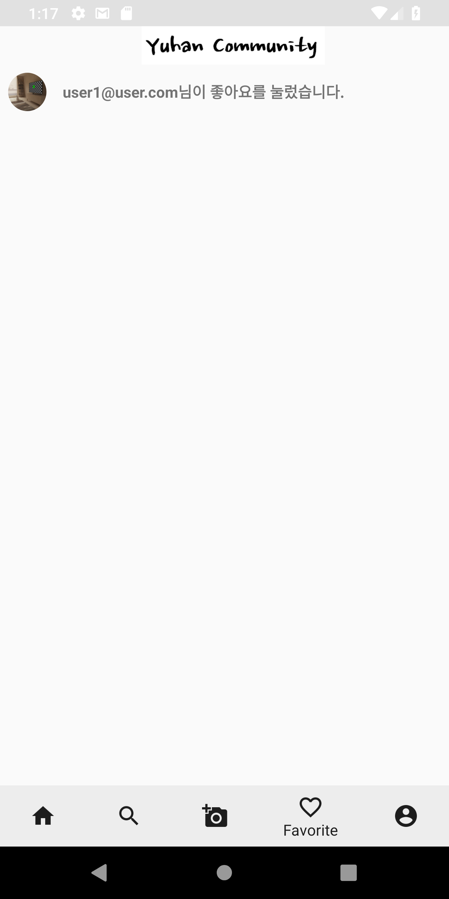
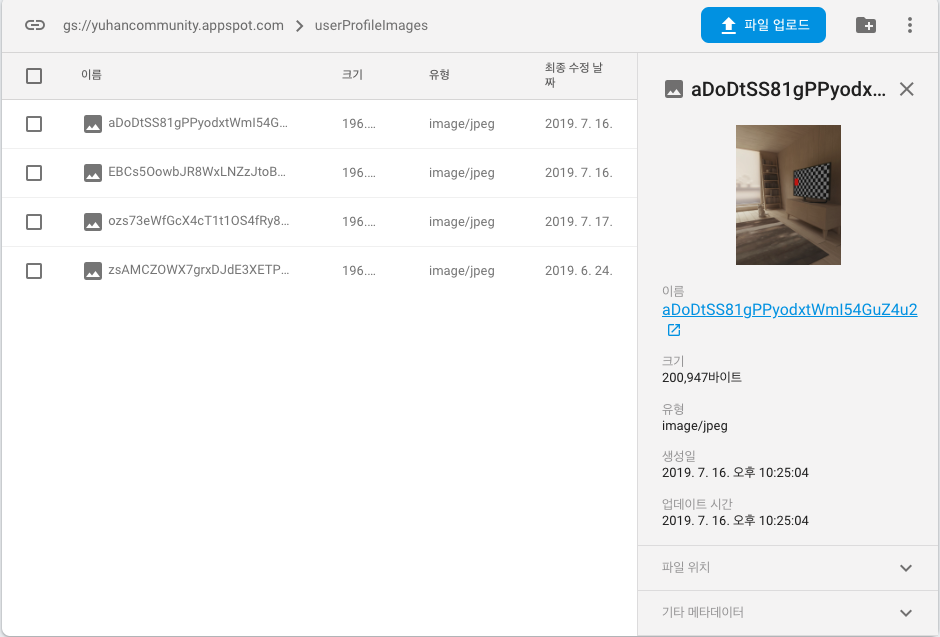

# YuhanCommunity

## 1. 개요
  Firebase 를 사용하여 개발한 유한대학교 학생들을 위한 커뮤니티 어플 입니다.

## 2. 개발 환경

  - OS : Mac Mojave( version : 10.14.5 )

  - 개발 언어 : Kotlin( version : 1.3.31 )

  - Tool : Android Studio ( version : 3.4.1 )

  - 외부 라이브러리 :

    | 
Tool
 | 
사용 목적
 | 
Version
 |
    |:---------------------:|:------------------------:|:------------------------:|
    | **Firebase-auth, Google-auth, Facebook-auth** | 파이어 베이스 이메일 로그인, 구글 로그인, 페이스북 로그인 기능 을 사용 하기 위해 추가 | firebase-auth:16.0.5, facebook-android-sdk:[5,6), play-services-auth:16.0.1 |
    | **Firebase-storage** | 프로필 사진 업로드, 게시글 사진 업로드 등 파일 업로드를 위한 파이어베이스 저장소 기능 추가 | 16.0.5 |
    | **Firebase-firestore(실시간 데이터베이스)** | 파이어베이스 실시간 데이터 베이스 기능을 사용하기 위해 추가 | 17.1.2 |
    | **Firebase-messaging** | 파이어베이스 클라우드 메세징 기능으로 메세징 서비스를 위해 추가 | 17.3.4 |
    | **Okhttp3** | Http 방식으로 푸시 호출을 하기 위해 추가 | 4.0.0-alpha02 |
    | **Gson** | 서버에 데이터를 보낼거나 받을때 Json 으로 변환하기 위해 추가 | 2.8.5 |
    | **Glide** | 서버에서 가져온 이미지를 좀 더 빠르게 로딩하기 위해 사용 | 4.9.0 |

  ### 어플 시연 영상

  

## Apps Views

### **1. Favorite Tap & Push Message**

게시물의 좋아요, 댓글, 회원의 팔로우 등을 했을때 해당 회원에게 Push Message 로 알려주고 난 뒤
어떤 알림인지 볼 수 있는 탭  

 **- 좋아요**

</img>
</img>

 **- 댓글**

</img>
</img>

 **- 팔로우**

</img>
</img>

### **2. Firebase Console**
Firebase 에서 제공하는 기능을 관리하기 위한 페이지 이며
데이터 관리 파일 관리 이외에도 다양한 기능들이 있다.

#### **- Firebase Authentication**

 신규회원이 회원가입을 하게 되면 Firebase Authentication에 유저정보가 추가
 되고 인증이 된 사용자를 Firebase console 에서 대쉬보드 형태로 볼수 있다.

#### **- Firebase Storage**

Cloud Storage, 이미지 및 동영상을 업로드 할 수 있고 업로드된 파일을 관리할 수 있는 콘솔이다.

- 프로필 사진

유저가 프로필 사진을 업로드하면 해당 유저의 uid(유저의 고유한 ID)가 이미지파일명이 되어 업로드 된다.

- 게시물

게시물을 새로 작성하면 게시물에 등록된 이미지는 업로드된 시간을 기준으로 이미지파일명으로 지정되어 업로드 된다.

#### **- Firebase firestore**
NoSQL 클라우드 데이터베이스, 실시간 리스너를 통해 클라이언트 애플리케이션 간에 데이터 동기화를 유지하고 네트워크 지연 시간이나 인터넷 연결에 상관없이 원할하게 반응하는 앱을 개발하기 쉽게 구성되어 있다.

- 프로필 사진

Storage로 업로드 된후 Storage에서 Image Url 주소를 받아 데이터베이스 Image Url 주소를 등록 한다. (중복데이터 방지를위해 컬렉션 명을 User의 Uid로 지정 하였다.)

- 게시물

사용자가 새로운 게시물을 작성하면 게시물이미지의 Url 주소와 좋아요를 누른 유저의 Uid ,좋아요 갯수, 작성자 ID, Uid , 게시물 내용이 컬렉션의 필드로 올라간다.

- 좋아요

좋아요를 누르면 해당 컬렉션에 좋아요를 누른 유저의 UID와 좋아요의 갯수 필드의 값이 추가된다.

- 댓글

기존의 게시글 컬렉션의 하위로 __comments__ 라는 컬렉션이 새로 생기며 이 컬렉션의 필드로는
댓글의 내용을 담은 comment 와 timestamp ,uid , userID 가 있다.

- 팔로우

유저가 다른 유저를 팔로우를 하면 users 컬렉션이 생성되고 해당유저의 대한 팔로워,팔로워 카운트 , 팔로잉, 팔로잉 카운트가 필드로 등록된다.

  ### **3. 사용자 인증**

  - **Main**

  </img>

  사용자가 로그인을 진행 할 수 있는 Activity, 이메일 로그인, 구글 로그인 , 페이스북 로그인이 가능하다.

  - **이메일 로그인**

  </img>

  __Firebase Email 인증__ 기능 을 사용해 로그인 데이터 베이스에 해당 로그인이 존재하지 않으면 계정 생성 후 로그인을 진행한다.

  - **구글 로그인**

  </img>

  __Firebase Google 인증__ 기능을 사용해 OAuth 토큰을 발급받아 구글 계정으로 사용자를 인증 한다.

  - **페이스북 로그인**

  </img>

  __Firebase Facebook 인증__ 기능을 사용해 OAuth 토큰을 발급해 사용자가 쉽게 Facebook 계정을 통해 로그인을 할 수 있다.

  ### **4. Home Tap**

  Firebase firestore 와 Firebase Storage 를 사용 하였고 실시간 업데이트로 게시글을 실시간으로 볼 수 있고, 팔로우 한 유저가 작성한 게시글만 볼 수 있다.

  - **게시물 보기**

  </img>

  - **게시물 등록(Gallery Tap)**

  </img>

  하단 NavTap 의 Gallery를 탭하면 게시물등록 Fragment로 이동하고 게시글을 작성할수 있다.
  게시글을 작성하면 작성자를 팔로우한 다른 유저가 실시간으로 확인할수 있다.

  - **Like 기능**

  </img>
  </img>

  유저가 게시글에 좋아요 버튼을 터치하면 해당 게시글의 좋아요의 카운트의 숫자가 올라가고 버튼의 이미지가 변경된다.

  - **댓글**

  </img>

  게시글에 댓글을 달면 해당 게시글의 댓글을 보고있는 다른 사용자도 실시간으로 댓글을 확인할수 있다.

### **5. SearchTap**
  - **전체게시글 보기**

  </img>

  Firebase Storage , FirebaseDB 를 사용하였고 모든 유저가 작성한 게시글을 전부 볼수 있다.

### **6. AccountTap**

  - **account**

  </img>

  본인 계정의 프로필 사진 등록이나 게시물 관리, 현재 자신의 팔로워가 몇명인지, 팔로잉 하고 있는 유저는 몇명인지를 확인 할 수 있다. (다른 유저의 프로필로 들어가면 로그아웃 버튼이 아니라 팔로우 버튼으로 변경 된다. )

  - **팔로우**

  </img>
  </img>

  사용자가 다른 사용자의 정보창으로 들어가 팔로우를 터치하면 버튼의 TEXT가 변경되며 팔로잉하는 유저의 팔로워 카운트의 값이 증가 한다.(본인계정의 팔로잉 카운트의 값도 같이 증가.)
